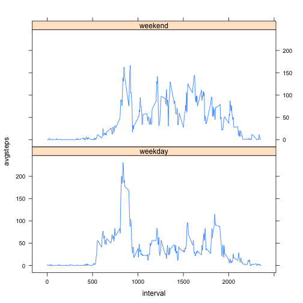

# Reproducible Research: Peer Assessment 1


## Loading and preprocessing the data

```r
# 1. Load the data (i.e. read.csv())
data1 <- read.csv("activity.csv", colClasses= c(steps="numeric",date="character",interval="numeric"))
# 2. Process/transform the data (if necessary) into a format suitable for your analysis
data2 <- data1[complete.cases(data1),]
```
## What is mean total number of steps taken per day?

```r
# 1. Make a histogram of the total number of steps taken each day
library("sqldf")
```

```
## Loading required package: gsubfn
## Loading required package: proto
## Loading required package: RSQLite
## Loading required package: DBI
## Loading required package: RSQLite.extfuns
```

```r
histo <-sqldf("select date, sum(steps) as totalsteps from data2 group by date")
```

```
## Loading required package: tcltk
```

```r
hist(as.numeric(histo[,2]), xlab = "Steps", main="Histogram of Total Steps")
```

 

```r
# 2. Calculate and report the mean and median total number of steps taken per day
mean(histo$totalsteps,na.rm="TRUE")
```

```
## [1] 10766
```

```r
median(histo$totalsteps,na.rm="TRUE")
```

```
## [1] 10765
```
## What is the average daily activity pattern?

```r
# 1. Make a time series plot (i.e. type = "l") of the 5-minute interval (x-axis) and the average number of steps taken, averaged across all days (y-axis)
activity <- sqldf("select interval, avg(steps) as avgsteps from data2 group by interval")
x <- activity[,1]
y <- activity[,2]
plot(x,y, type = "l", xlab="Interval", ylab="Average Steps")
```

 

```r
# 2. Which 5-minute interval, on average across all the days in the dataset, contains the maximum number of steps?
activitymax <- sqldf("select * from activity where avgsteps=(select max(avgsteps) from activity)")
print(activitymax)
```

```
##   interval avgsteps
## 1      835    206.2
```
## Imputing missing values

```r
# 1.Calculate and report the total number of missing values in the dataset (i.e. the total number of rows with NAs)
sum(is.na(data1$steps))
```

```
## [1] 2304
```

```r
# 2.Devise a strategy for filling in all of the missing values in the dataset. The strategy does not need to be sophisticated. For example, you could use the mean/median for that day, or the mean for that 5-minute interval, etc.
missing <- data1[!complete.cases(data1),] #Find missing
#Add in missing averages
sim.missing <- sqldf("select a.date, a.interval, b.avgsteps as steps from missing a left join activity b on a.interval = b.interval")
# 3. Create a new dataset that is equal to the original dataset but with the missing data filled in.
allsimulated <- rbind(data2,sim.missing)
# 4. Make a histogram of the total number of steps taken each day and Calculate and report the mean and median total number of steps taken per day. Do these values differ from the estimates from the first part of the assignment? What is the impact of imputing missing data on the estimates of the total daily number of steps?
hist.sim <-sqldf("select date, sum(steps) as totalsteps from allsimulated group by date")
hist(as.numeric(hist.sim[,2]), xlab = "Steps", main="Total Steps - NA as Mean")
```

 

```r
mean(hist.sim$totalsteps)
```

```
## [1] 10766
```

```r
median(hist.sim$totalsteps)
```

```
## [1] 10766
```
## Are there differences in activity patterns between weekdays and weekends?

```r
# 1. Create a new factor variable in the dataset with two levels – “weekday” and “weekend” indicating whether a given date is a weekday or weekend day.
allsimulated$weektime <- as.factor(ifelse(weekdays(as.Date(allsimulated$date)) %in% c("Saturday","Sunday"),"weekend", "weekday"))
# Create averages by interval and if it is weekday or not
sim.means <- sqldf("select interval, weektime, avg(steps) as avgsteps from allsimulated group by interval, weektime")
# 2. Make a panel plot containing a time series plot (i.e. type = "l") of the 5-minute interval (x-axis) and the average number of steps taken, averaged across all weekday days or weekend days (y-axis). The plot should look something like the following, which was creating using simulated data:
library(lattice)
xyplot(avgsteps~interval | weektime, data=sim.means, pch=".", type ="l", layout = c(1, 2))
```

 


